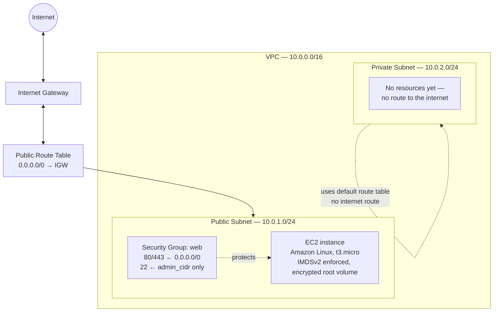

# Secure VPC on AWS — Terraform

Infrastructure as Code (IaC) for deploying a secure VPC on AWS using Terraform: public/private subnets, a least-privilege security group, and a hardened EC2 instance.

This is a portfolio project built while transitioning from Security Analyst / SOC into DevOps / DevSecOps. The goal isn't the EC2 instance itself — it's demonstrating that security principles (least privilege, defense in depth, fail-safe defaults) can be encoded directly into infrastructure code instead of relying on manual configuration or after-the-fact hardening.

## Architecture



The public subnet is routed to the internet via the Internet Gateway; the private subnet intentionally has no such route — it uses the VPC's implicit default route table, so it stays unreachable from the internet without any explicit "deny" rule. Nothing is deployed there yet; it exists to demonstrate the public/private split, ready for a future backend resource (e.g. a database) that should never be internet-facing.

## Resources created

| Resource | Purpose |
|---|---|
| `aws_vpc.main` | Isolated network space (`10.0.0.0/16`) |
| `aws_internet_gateway.main` | Enables internet connectivity for the VPC |
| `aws_subnet.public` / `aws_subnet.private` | Network segmentation (`10.0.1.0/24`, `10.0.2.0/24`) |
| `aws_route_table.public` + association | Explicit internet route, applied only to the public subnet |
| `aws_security_group.web` | Instance-level firewall — least-privilege ingress rules |
| `data.aws_ami.amazon_linux` | Always resolves to the latest Amazon Linux 2023 AMI at apply time |
| `aws_key_pair.admin` | SSH public key for instance access |
| `aws_instance.web` | Hardened EC2 instance in the public subnet |

## Security decisions and rationale

**SSH restricted to a single admin IP, never `0.0.0.0/0`.**
Port 22 is one of the most scanned ports on the internet; leaving it open invites constant brute-force attempts. The `admin_cidr` variable has no default (it must be explicitly set) and carries a `validation` block that fails `terraform plan` if someone tries to set it to `0.0.0.0/0` — the check is enforced by the code itself, not by a human remembering a rule.

**HTTP/HTTPS open to everyone, on purpose.**
The instance's job is to serve public web traffic, so 80/443 are open to `0.0.0.0/0`. Security here isn't "block everyone" — it's "expose only what the resource is meant to expose."

**Private subnet has no internet route — a fail-safe default, not a block rule.**
It was never associated with a route table containing `0.0.0.0/0 → IGW`, so it falls back to the VPC's implicit main route table, which has no such route. Nothing had to be explicitly "closed"; it simply was never opened. This is the same pattern as a DMZ vs. internal network split — with the caveat that AWS's implicit local routing still lets same-VPC subnets reach each other at the network layer, so any future private resource still needs its own security group scoped to `source_security_group_id` (referencing the web tier's SG by ID, not by IP or CIDR) rather than trusting subnet boundaries alone.

**IMDSv2 enforced (`http_tokens = "required"`).**
The EC2 Instance Metadata Service exposes the instance's IAM role credentials at `169.254.169.254` to anything running on the box. IMDSv1 answers unauthenticated `GET` requests, making it exploitable via SSRF (the vector behind the 2019 Capital One breach). IMDSv2 requires a session token obtained via a `PUT` request first — a step a typical SSRF payload can't complete — closing off that path.

**Encrypted root volume.**
Data at rest is encrypted, independent of network-level controls — defense in depth in case a volume snapshot or disk is ever exposed outside the running instance.

**AMI resolved via data source, never hardcoded.**
`data.aws_ami.amazon_linux` always resolves to the most recent Amazon Linux 2023 AMI at apply time, so redeploys don't silently run on a stale, unpatched image.

**Dedicated, passphrase-protected SSH key — not a reused key.**
The key pair used for this project was generated specifically for it (`ssh-keygen -t ed25519`), separate from any key used for other services (e.g. GitLab). One key per purpose limits blast radius if a key ever needs to be revoked, and the passphrase protects the private key at rest even if the key file itself were copied.

**Secrets never committed.**
`terraform.tfvars` (real `admin_cidr` and `ssh_public_key` values) and `*.tfstate` (which would contain the instance's resolved public IP, AMI ID, etc.) are gitignored. Only variable/output *declarations* — types and descriptions, never values — are committed.

## Known trade-offs / next improvements

- The IAM user used to run Terraform (`terraform-cli`) has `AmazonEC2FullAccess`, `AmazonVPCFullAccess`, `AmazonS3FullAccess`, and `IAMFullAccess` attached — not `AdministratorAccess`, but still broader than this project strictly needs (no S3 or IAM resources are created by the current config; those two were added ahead of planned work like a remote state backend and instance IAM roles). `IAMFullAccess` in particular is worth calling out: it can create and attach policies to other identities, which is a privilege-escalation path if the credentials were ever compromised. A tighter setup would use a custom policy scoped to the specific actions Terraform actually calls, adding S3/IAM permissions only when those resources are actually introduced.
- Security group egress is fully open (`0.0.0.0/0`, all ports). Restricting outbound traffic is a further hardening step, deferred here since it requires enumerating every destination the instance legitimately needs.
- State is currently local. A remote backend (S3 + DynamoDB for locking) is a planned addition.
- No automated `terraform validate` / `tfsec` checks in CI yet — planned as a GitHub Actions workflow.

## Usage

### Prerequisites
- Terraform >= 1.5.0
- An AWS account and an IAM user with programmatic access configured locally (`aws configure`)
- An SSH key pair (`ssh-keygen -t ed25519 -C "<purpose>" -f ~/.ssh/<name>`)

### Configure
Create a `terraform.tfvars` file (gitignored, never commit it):

```hcl
admin_cidr     = "<your-public-ip>/32"
ssh_public_key = "<contents of your .pub file>"
```

### Deploy
```
terraform init
terraform plan
terraform apply
```

### Connect
```
ssh -i ~/.ssh/<your-private-key> ec2-user@$(terraform output -raw instance_public_ip)
```

### Tear down
```
terraform destroy
```
